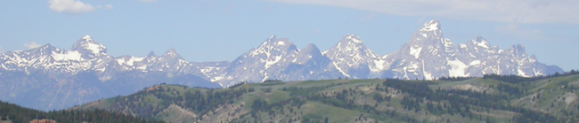

.. Thermochronology short course documentation master file, created by
   sphinx-quickstart on Fri Oct 13 14:54:34 2017.
   You can adapt this file completely to your liking, but it should at least
   contain the root `toctree` directive.

Short course on low-temperature thermochronology
================================================

Low-temperature thermochronology is a geochronological method based on the temperature-sensitive retention of a radiogenically produced daughter product in mineral crystals.
It is widely used to quantify long-term rates of tectonic and erosional processes in mountainous regions, but can also be applied to study erosional processes in ancient settings.
In this course you will learn the fundamental concepts of thermochronology and its applications, be introduced to common mineral dating systems by European experts in thermochronology, and work with numerical tools for analyzing and interpreting thermochronometer data.

Course goals
------------
This course aims to:

1. Introduce the basic concepts of thermochronology and thermal processes in the crust
2. Provide an in-depth view into the systematics of popular thermochronometer systems, including (U-Th)/He, fission-track, and :sup:`40`\ Ar/:sup:`39`\ Ar dating in a variety of minerals
3. Support lecture-based knowledge with computational exercises from simple equations in Excel to sophisticated 3D thermal modelling

Target audience
---------------
Doctoral students (Master’s students will be considered if space is available)

Instructors
-----------
- `Cécile Gautheron <http://geosciences.geol.u-psud.fr/spip.php?article115>`__, Department of Earth Sciences, Paris-Sud University, France
- `Christoph Glotzbach <http://www.uni-tuebingen.de/fakultaeten/mathematisch-naturwissenschaftliche-fakultaet/fachbereiche/geowissenschaften/arbeitsgruppen/mineralogie-geodynamik/forschungsbereich/geologie-geodynamik/people/christoph-glotzbach.html>`__, Department of Geosciences, University of Tübingen, Germany
- `Clare Warren <http://www.open.ac.uk/people/cw6522>`__, School of Environment, Earth & Ecosystem Sciences, The Open University, U.K.

with contributions by `David Whipp <http://www.helsinki.fi/geo/staff/whipp/>`__ and `Ilmo Kukkonen <https://tuhat.helsinki.fi/portal/en/persons/ilmo-kukkonen(2872f41a-6d51-45c2-9cef-66d55bf5f679).html>`__, University of Helsinki

Course fee
----------
There is no fee for the course.
Costs associated with the invited lecturers are covered by the `Doctoral Programme in Geosciences at the University of Helsinki <https://www.helsinki.fi/en/research/doctoral-education/doctoral-schools-and-programmes/doctoral-school-in-natural-sciences/doctoral-programme-in-geosciences>`__.

Schedule
--------

+--------+------------+-----------------------------------+
| Day    | Date       | Theme                             |
+========+============+===================================+
| **1**  | 23.10.2017 | Basics of thermochronology,       |
|        |            | crustal thermal processes         |
+--------+------------+-----------------------------------+
| **2**  | 24.10.2017 | :sup:`40`\ Ar/ :sup:`39`\ Ar      |
|        |            | thermochronology                  |
+--------+------------+-----------------------------------+
| **3**  | 25.10.2017 | Fission-track thermochronology    |
+--------+------------+-----------------------------------+
| **4**  | 26.10.2017 | (U-Th)/He thermochronology        |
+--------+------------+-----------------------------------+
| **5**  | 27.10.2017 | Data modelling and interpretation |
|        |            | using Pecube                      |
+--------+------------+-----------------------------------+

|

.. admonition:: Open access!

    Materials for this course are **open to everyone**.
    Please let us know if you find them useful!

.. admonition:: Teachers: Use our stuff!

    If you would like to use these materials as part of your own teaching or develop them further, we strongly support that.
    Please have a look at :doc:`our licensing terms<general-info/licensing>` about how to do so.

.. toctree::
   :maxdepth: 2
   :caption: Course information

   general-info/course-details
   general-info/software-installation
   general-info/licensing

.. toctree::
   :maxdepth: 2
   :caption: Day 1

   lessons/Day-1/overview
   lessons/Day-1/lecture-materials
   lessons/Day-1/lecture-videos

.. toctree::
   :maxdepth: 2
   :caption: Day 2

   lessons/Day-2/overview
   lessons/Day-2/lecture-materials
   lessons/Day-2/lecture-videos
